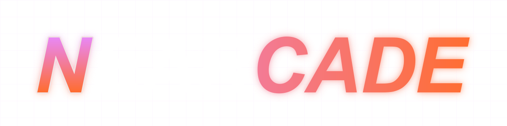
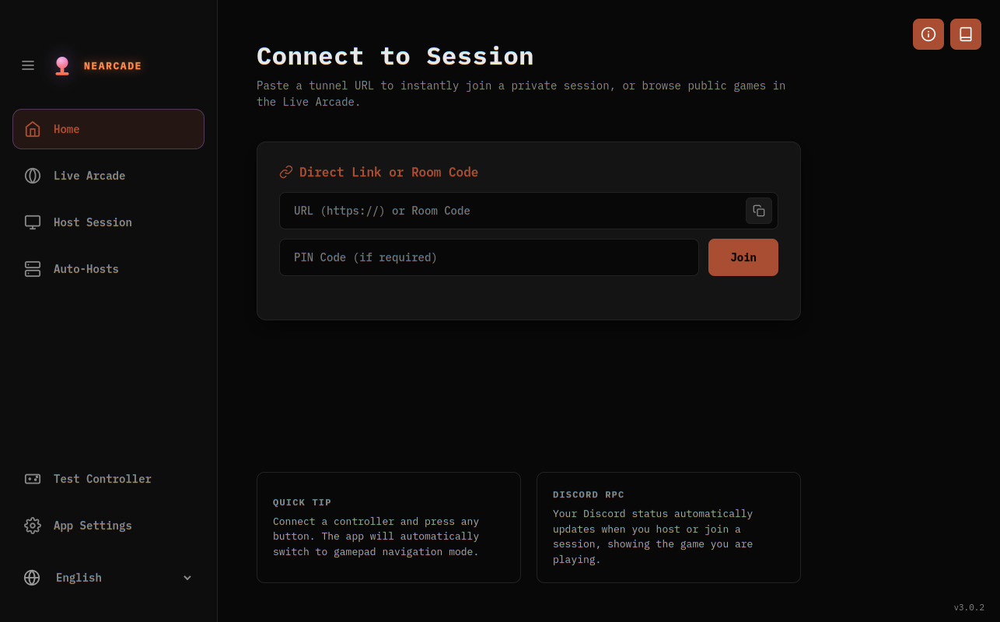
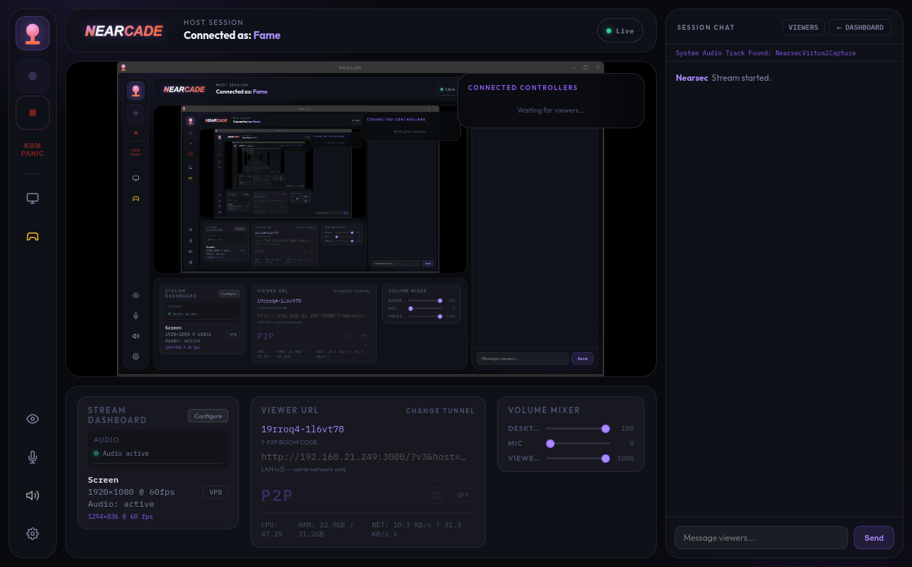
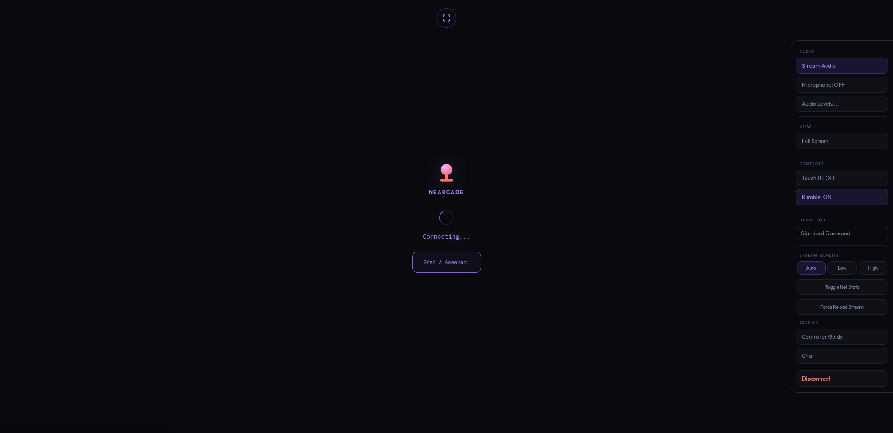
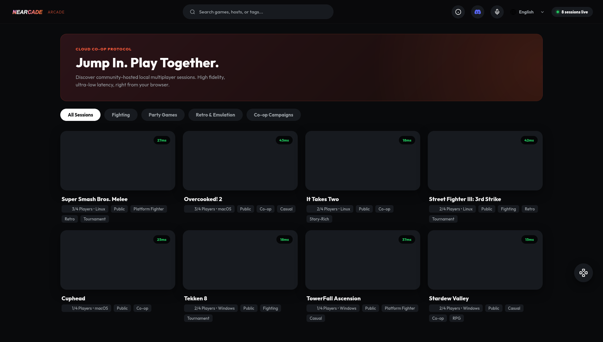

<p align="left">
  
<h1>Nearcade <a href="https://discord.gg/Yz3NeEBdPQ" target="_blank" title="Join our Discord"></a></h1>

[English](README.md) | [Español](README.es.md) | [Français](README.fr.md) | [Deutsch](README.de.md) | [Português](README.pt.md) | [日本語](README.ja.md)
## Screenshots -- Dashboard, Viewer Page, Arcade

<div align="center">
  
  
  
  
</div>

## Project Mission
Nearcade is an open-source platform that lets you play local co-op games over the internet with friends. It is built for self-hosted setups. It uses peer-to-peer connections and native operating system audio and input routing to keep input delay low.

The main focus is private setups. The host app requires no special network configuration. Viewers join through a standard web browser on desktop or mobile devices. The mobile viewer interface includes touch controls and a virtual joystick. Users do not need to download anything to play.

## System Requirements
You need specific software installed on your machine to run the host application.

### Required Software
* Node.js version 18 or newer.
* Python 3 for the controller virtualization bridge.
* Git to download the source code.

### Linux Requirements
* PipeWire must be your active audio server. The app targets PipeWire nodes directly to separate game audio from voice chats. It will not work with PulseAudio.
* Your kernel must have the uinput module enabled so the app can create native virtual gamepads.
* The system deploys native udev rules to block mouse and keyboard confusion flags. This bypasses normal Steam Input limits. The provided setup script handles this step.

### Windows Requirements
* You must install the ViGEmBus driver manually to enable gamepad support on Windows.

### Bundled Dependencies
The app bundles Cloudflared and Zrok binaries for tunneling and runs them natively. You do not need to install these manually. The network routing relies on an external Rust VPS Router for signaling, while media streaming happens primarily over ultra low-latency WebCodecs pipelines or WebRTC.

## Platform Support Matrix

| Feature | Linux | Windows | macOS |
|---|---|---|---|
| Platform Streaming (WebCodecs / WebRTC) | Full | Full | Full |
| Gamepad Support | Full | Conditional | None |
| Keyboard and Mouse Input | Full | Limited | Full |
| Multi-Controller | Full | Limited | None |
| Audio Playback | Full | Full | Full |
| Stability Level | Production | Experimental | Experimental |

## Installation and Documentation
Most users will run the compiled executable file directly. The application handles system setup automatically on launch.

You only need to run the setup script manually if you are using the source code or if the compiled app fails to set up your system. To run the Linux setup script manually, navigate to the bin folder from the root of the project.

```bash
cd bin
sudo ./linux_setup.sh
```

We keep all technical setup instructions, dependency lists, and API guides in a dedicated documentation directory. This keeps the main page clean. You can read these files from the Host Dashboard book icon or by clicking the links below.

* [Getting Started Guide](src/docs/GETTING_STARTED.md)
* [Host Usage Manual](src/docs/HOST_USAGE.md)
* [API and Setup Guide](src/docs/API_AND_SETUP.md)
* [VPS Server Setup](src/docs/VPS_SETUP.md)
* [Advanced Logic Documentation](src/docs/ADVANCED_LOGIC.md)
* [Nearcade Arcade Info](src/docs/NEARCADE_ARCADE.md)

## Nearcade Arcade
The platform includes an optional public lobby system. Hosts can list their sessions on the Arcade grid to let global players discover and join local co-op games. You can view the public lobby at https://nearcade.cutefame.net and join active sessions directly from your browser.

## Browser Userscript (Identity Persistence)
Your display name and chat color only save per-site by default. The identity persistence userscript has been migrated to the [OpenRemotePlay](https://github.com/TheRealFame/OpenRemotePlay) repository to act as a universal identity manager for any platform using the OpenRemotePlay protocol.

Install this universal userscript with [Tampermonkey](https://www.tampermonkey.net/) or any fork and your identity will seamlessly follow you across all Nearcade sessions — Cloudflare tunnels, zrok, localhost, anywhere.

[Install OpenRemotePlay Identity Persist](https://github.com/TheRealFame/OpenRemotePlay/raw/main/openremoteplay-identity-persist.user.js)

## Open Remote Play (ORP) Protocol
Nearcade's peer-to-peer connection layer is the basis for [Open Remote Play](https://github.com/TheRealFame/OpenRemotePlay), an open, MIT-licensed protocol specification for remote-play interoperability across independently developed clients and hosts. The identity persistence userscript above already runs on the ORP protocol today.

The wider v2 specification — serverless signaling, a defined sub-2-second connection budget, STUN-only NAT traversal with a forced hole-punch retry tier, and a trust model built around PIN possession rather than any static shared secret — is currently a draft, not yet adopted into Nearcade's own connection code. Nearcade's existing signaling (Trystero over BitTorrent trackers, see [Advanced Logic Documentation](src/docs/ADVANCED_LOGIC.md)) is one of the two signaling strategies the v2 spec formalizes; the Nostr-primary racing strategy and the rest of v2 have not yet been implemented in this repository. See the [ORP specification](https://github.com/TheRealFame/OpenRemotePlay/blob/main/spec/ORP_SPEC.md) for what's covered and what's still open.

ORP is not tied to Nearcade's specific WebCodecs/WebRTC pipeline. Any project can use ORP's connection and signaling layer with its own media pipeline, and the [ORP repository](https://github.com/TheRealFame/OpenRemotePlay#using-orp-with-your-own-pipeline) documents how, including when a pull request against the protocol itself is the right path for a pipeline that needs something the current spec doesn't yet provide.

This project uses artificial intelligence large language models for code generation and structure planning.